# Credit_Risk_Analysis

## Purpose

## Results

### Naive Oversampling

#### Balanced Accuracy Score
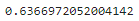

#### Imbalanced Classification Report 
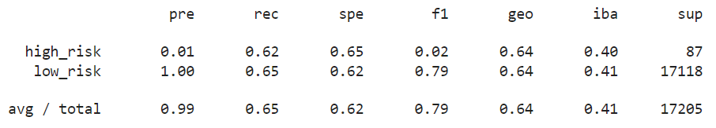

### SMOTE Oversampling

#### Balanced Accuracy Score

#### Imbalanced Classification Report
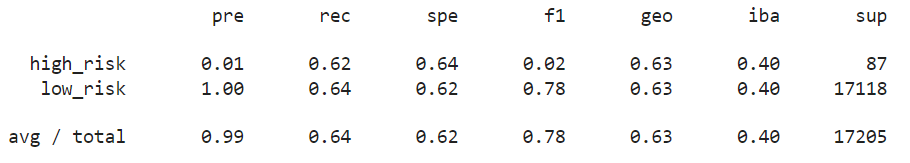

### ClusterCentroid Undersampling

#### Balanced Accuracy Score
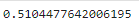

#### Imbalanced Classification Report
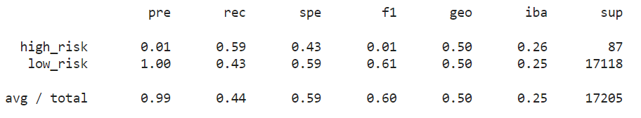

### SMOTEENN (Over and Under) Sampling

#### Balanced Accuracy Score
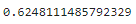

#### Imbalanced Classification Report
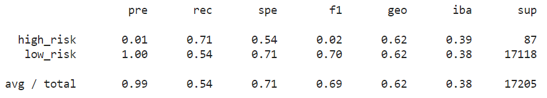

### BalancedRandomForestClassifier

#### Balanced Accuracy Score
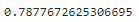

#### Imbalanced Classification Report
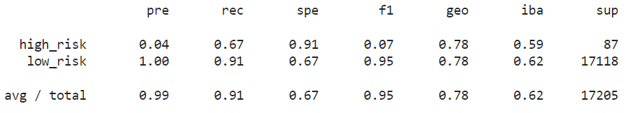

### EasyEnsembleClassifier

#### Balanced Accuracy Score
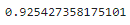

#### Imbalanced Classification Report
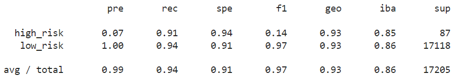
