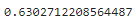

# Credit_Risk_Analysis

## Purpose

## Results

### Naive Oversampling

#### Balanced Accuracy Score

#### Imbalanced Classification Report 

### SMOTE Oversampling

#### Balanced Accuracy Score

#### Imbalanced Classification Report

### ClusterCentroid Undersampling

#### Balanced Accuracy Score

#### Imbalanced Classification Report

### SMOTEENN (Over and Under) Sampling

#### Balanced Accuracy Score

#### Imbalanced Classification Report

### BalancedRandomForestClassifier

#### Balanced Accuracy Score

#### Imbalanced Classification Report

### EasyEnsembleClassifier

#### Balanced Accuracy Score

#### Imbalanced Classification Report

